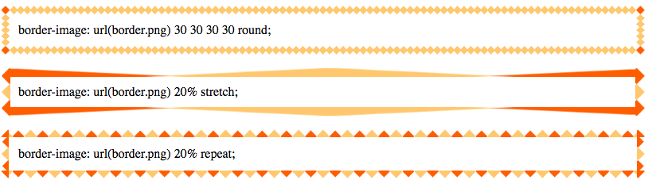

#Border-image

The border-image property allows you to use an image to create a border around an element. The border-image property is a CSS short-hand property, which means it is composed of several exisiting CSS properties which acheive the same result, but through longer means. When used, the `border-image` property replaces `border-style`. If one of its constituent property values is left blank, that the value will be its default. For instance, the default value of `border-image-width` is 1. 

##Properties and Values
<br>

- `border-image-source` - the source of the image to be used 
	
		border-image-source: url(border.png);

- `border-image-slice` - allows for the styling of the border image in a 9 section grid: the four corners, the four sides between the corners, and the middle of the element that is surrounded by the border. The values of these "slices" can be declared with either pixels or %. 

		border-image-slice: 30;

- `border-image-width` - Defines the width of the image used that will construct the border-image. The border image width only corresponds to the section which will be stretched, repeated, or rounded, NOT the width of the actual border. All sides can be declared at once with one value, or different sides can be declared like in the `border-width` CSS property. 

		border-image-width: 10px;

- `border-image-outset` - Changing the outset values changes the shape of the 9 section grid, and thus what part of the base image is displayed in each section. This propert can take from one to four values which represent the top, right, bottom and left sides

		border-image-outset: 10px 20px 10px 20px;

- `border-image-repeat` - Values are `repeat`, `round`, and `stretch`. These values can be applied to the vertical or horizontal pair of sides. Repeat repeats the selection which is within the center section of the grid, whereas stretch stretches the center selection to fill the whole space. The Round value is similar to repeat except that it will not display a partial image of the repeated section, it will only show the image in repeated whole increments. 

<br>


If these property values were applied to the `border-image` syntax in combination it would look like:

```
.element {
    border-image: border-image-source border-image-slice border-image-width 
   	border-image-outset border-image-repeat;
}
``` 
 
 <br>
 
 However, only the properties `border-image-source`, `border-image-slice`, and `border-image-repeat` are required to render a border image. 
 
 
 To gain an interactive understanding of this property visit [http://border-image.com/](http://border-image.com/)
 <br>
 
###Examples

```
#border1 {
    padding: 10px;
    border: 12px solid transparent;
    -webkit-border-image: url(border.png) 30 30 30 30 round; /* Safari 3.1-5 */
    -o-border-image: url(border.png)30 30 30 30 round; /* Opera 11-12.1 */
    border-image: url(border.png) 30 30 30 30 round;
}

#border2 {
    padding: 10px;
    border: 12px solid transparent;
    -webkit-border-image: url(border.png) 20% stretch; /* Safari 3.1-5 */
    -o-border-image: url(border.png) 20% stretch; /* Opera 11-12.1 */
    border-image: url(border.png) 20% stretch;
}

#border3 {
    padding: 12px;
    border: 10px solid transparent;
    -webkit-border-image: url(border.png) 20% repeat; /* Safari 3.1-5 */
    -o-border-image: url(border.png) 20% repeat; /* Opera 11-12.1 */
    border-image: url(border.png) 20% repeat;
}
```



###Browser Support
<table>
	<tr>
		<th>Feature</th>
			<th>Chrome</th>
			<th>Firefox / (Gecko)</th>
			<th>Internet Explorer</th>	
			<th>Opera</th>
			<th>Safari</th>
		<tr>
			<td>Basic support</td>
			<td>Full support for version 15 and up</td>
			<td>Full sypport for version 16.0 and up</td>
			<td>Yes</td>
			<td>Unknown</td>
			<td>Yes</td>
		</tr>
		<tr>
			<td>Parses leading-zero strings as decimal, not octal</td>
			<td>Yes</td>
			<td>Version 21 and up</td>
			<td>(Yes) (in standards mode)</td>
			<td>Unknown</td>
			<td>Yes</td>
		</tr>
</table>
			


